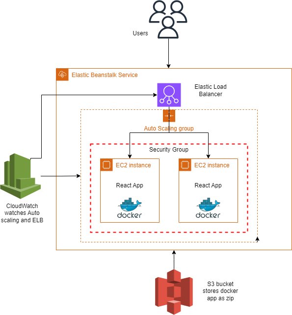

# Dockerized React App on Elastic BeanStalk

## This project automates deploying a Dockerized React app to AWS Elastic Beanstalk using Terraform for setup and GitHub Actions for continuous deployment.

This sample project demonstrates the end-to-end automation of deploying a Dockerized React app to AWS Elastic Beanstalk. Using Terraform, it creates and uploads a code zip file to an S3 bucket, sets up an Elastic Beanstalk environment, and deploys the application version. GitHub Actions is integrated for continuous deployment, ensuring automatic updates to the Elastic Beanstalk environment when code changes occur. This example guides you through performing the following actions:

* Develop a React application.
* Create a Dockerfile for the React application.
* Use Terraform to package the React application into a zip file.
* Utilize Terraform to provision an S3 bucket and upload the zip file.
* Define an application version using Terraform.
* Set up an Elastic Beanstalk environment and configure it with the specified application version.
* Create an instance profile and associate it with EC2 instances.
* Implement continuous deployment of the Dockerized React application to Elastic Beanstalk using GitHub Actions.

## Infrastructure Diagram
![Infrastructure Diagram]


## How to use this example project
* Setup AWS CLI.
* Generate keys on AWS to use with AWS CLI.
* Install terraform.

Run these commands from the root directory of the project
```bash
cd infra
terraform init
terraform validate
terraform plan
terraform apply
```


## Find a bug
If you encounter an issue or have suggestions for improving this project, please submit an issue via the "Issues" tab above.

## Author

[Sharique Ali](https://github.com/sharique-tech1987)

